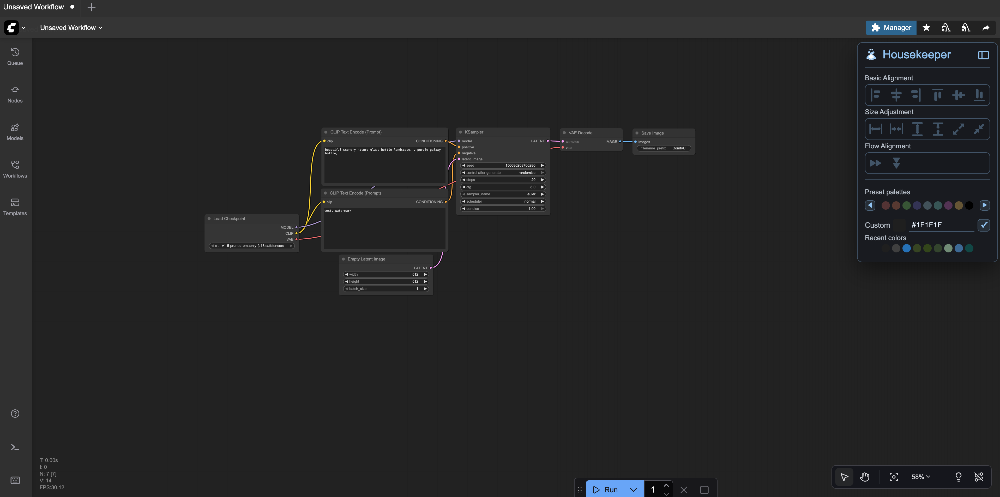
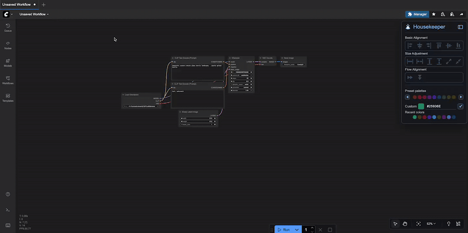
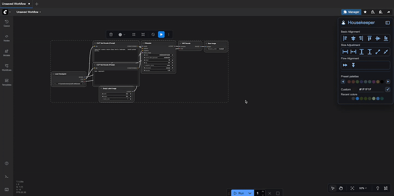
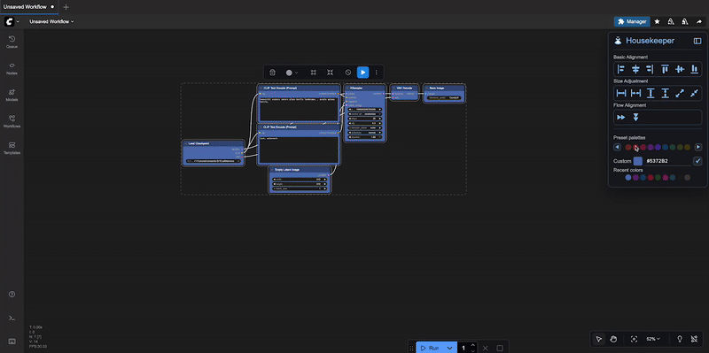

<div align="center">

#  comfyui-housekeeper
### ComfyUI Node Alignment & Color Tool

</div>

A ComfyUI extension that provides node alignment tools and color management for organizing your workflows. It runs entirely in the browser and adds no nodes to your node menu.

## Updates

### 2026-08-12 — v0.2.0
- **Hover preview now appears where it should.** It was being drawn about a screen height above the canvas on most installs, so it looked like the feature did nothing ([#24](https://github.com/joanna910225/comfyui-housekeeper/issues/24))
- **Panel no longer covers ComfyUI's right sidebar** ([#25](https://github.com/joanna910225/comfyui-housekeeper/issues/25))
- **Ctrl+Z now undoes an alignment** in a single step
- **Keyboard shortcuts no longer fire while you are typing** in a prompt widget
- **Flow alignment orders nodes within a column by vertical position**, as documented
- Housekeeper is now frontend-only — the three unused placeholder nodes have been removed, and it no longer fails to load on ComfyUI builds without `comfy_config`

See [CHANGELOG.md](CHANGELOG.md) for the full list.

### 2025-12-02
- **Compatible with recent Vue changes of ComfyUI official package**

<div align="center">

</div>

## Demo

<div align="center">

### Node Alignment


### Size Alignment


### Color Management


</div>

## Features

- 6 alignment options — four edge and two center alignments
- Size normalization for consistent node dimensions
- Flow-based arrangement using workflow connections
- Preset color palettes for node styling
- Custom color picker with recent colors memory
- Hover preview showing alignment results before applying

## Installation

Navigate to your ComfyUI custom nodes directory and clone:

```bash
cd ComfyUI/custom_nodes/
git clone https://github.com/joanna910225/comfyui-housekeeper.git
```

Restart ComfyUI to load the custom node.

## Usage


The Housekeeper handle appears on the right side of the canvas after installation. Click to open the panel. Select 2 or more nodes to use alignment features.

### Basic Alignment

**Edge Alignment:**
- **Left**: Align all nodes to the leftmost edge with vertical spacing
- **Right**: Align all nodes to the rightmost edge with vertical spacing
- **Top**: Align all nodes to the topmost edge with horizontal spacing
- **Bottom**: Align all nodes to the bottommost edge with horizontal spacing

**Center Alignment:**
- **Height-Center**: Align horizontal centers on a vertical line with vertical spacing
- **Width-Center**: Align vertical centers on a horizontal line with horizontal spacing

### Size Adjustment

Match node dimensions for consistent layouts:
- **Width-Max**: Set all nodes to the widest width
- **Width-Min**: Set all nodes to the narrowest width
- **Height-Max**: Set all nodes to the tallest height
- **Height-Min**: Set all nodes to the shortest height
- **Size-Max**: Set all nodes to the largest dimensions (width × height)
- **Size-Min**: Shrink each node to its minimum accepted size

### Flow Alignment

Arrange nodes based on workflow connections:
- **H-Flow**: Arrange nodes left-to-right in columns by workflow dependencies
- **V-Flow**: Arrange nodes top-to-bottom in rows by workflow dependencies

### Preset Palettes

Browse curated color sets with arrow navigation. Click any color chip to apply it to all selected nodes.

### Custom Colors

Pick any color using the color picker or enter hex codes. Click the checkmark to apply.

### Recent Colors

The panel automatically remembers your last used colors for quick access.

## Keyboard Shortcuts

Use `Cmd` in place of `Ctrl` on macOS. Shortcuts are ignored while the focus is in a text field, so they will not interfere with typing in a prompt widget.

| Shortcut | Action |
| --- | --- |
| `Ctrl+Shift+H` | Show / hide the panel |
| `Ctrl+Shift+←` | Align left edges |
| `Ctrl+Shift+→` | Align right edges |
| `Ctrl+Shift+↑` | Align top edges |
| `Ctrl+Shift+↓` | Align bottom edges |
| `Ctrl+Alt+→` | Horizontal flow |
| `Ctrl+Alt+↓` | Vertical flow |

Every operation is a single undo step — press `Ctrl+Z` once to revert it.
