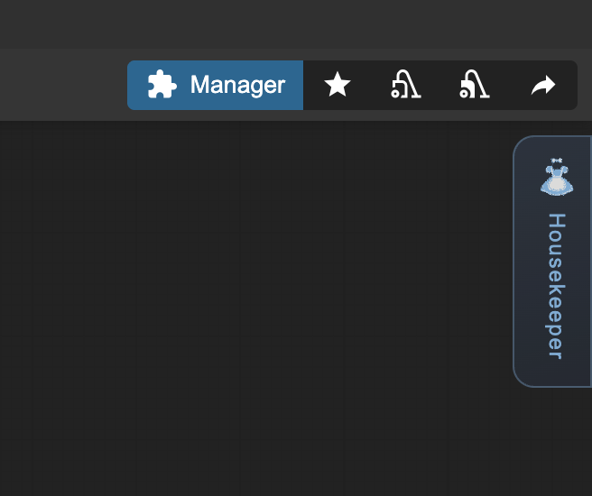

<div align="center">

#  comfyui-housekeeper
### ComfyUI Node Alignment & Color Tool

</div>

A ComfyUI custom node that provides comprehensive node alignment tools and color management for organizing your workflows.

<div align="center">

</div>

## Demo

<div align="center">

### Node Alignment


### Size Alignment


### Color Management


</div>

## Features

- 14 alignment options including edge and center alignments
- Size normalization for consistent node dimensions
- Flow-based arrangement using workflow connections
- Preset color palettes for node styling
- Custom color picker with recent colors memory
- Hover preview showing alignment results before applying

## Installation

Navigate to your ComfyUI custom nodes directory and clone:

```bash
cd ComfyUI/custom_nodes/
git clone https://github.com/joanna910225/comfyui-housekeeper.git
```

Restart ComfyUI to load the custom node.

## Usage



The Housekeeper handle appears on the right side of the canvas after installation. Click to open the panel. Select 2 or more nodes to use alignment features.

### Basic Alignment

**Edge Alignment:**
- **Left**: Align all nodes to the leftmost edge with vertical spacing
- **Right**: Align all nodes to the rightmost edge with vertical spacing
- **Top**: Align all nodes to the topmost edge with horizontal spacing
- **Bottom**: Align all nodes to the bottommost edge with horizontal spacing

**Center Alignment:**
- **Height-Center**: Align horizontal centers on a vertical line with vertical spacing
- **Width-Center**: Align vertical centers on a horizontal line with horizontal spacing

### Size Adjustment

Match node dimensions for consistent layouts:
- **Width-Max**: Set all nodes to the widest width
- **Width-Min**: Set all nodes to the narrowest width
- **Height-Max**: Set all nodes to the tallest height
- **Height-Min**: Set all nodes to the shortest height
- **Size-Max**: Set all nodes to the largest dimensions (width × height)
- **Size-Min**: Shrink each node to its minimum accepted size

### Flow Alignment

Arrange nodes based on workflow connections:
- **H-Flow**: Arrange nodes left-to-right in columns by workflow dependencies
- **V-Flow**: Arrange nodes top-to-bottom in rows by workflow dependencies

### Preset Palettes

Browse curated color sets with arrow navigation. Click any color chip to apply it to all selected nodes.

### Custom Colors

Pick any color using the color picker or enter hex codes. Click the checkmark to apply.

### Recent Colors

The panel automatically remembers your last used colors for quick access.

## Updates

### 02/12/2025
- **Compatible with recent Vue changes of ComfyUI official package** - Fixed compatibility issues with updated ComfyUI versions by removing Vue component dependencies and using pure JavaScript implementation for the alignment panel.
